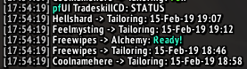

This addon is an external module for [pfUI](https://gitlab.com/shagu/pfUI) addon.

## Screenshots





## Description
Addon (locale independant) allows you to keep track of tradeskill cooldowns across all characters on your account.


## Installation
**This addon will not function without [pfUI](https://gitlab.com/shagu/pfUI) installed**
1. Download **[Latest Version](https://gitlab.com/dein0s_wow_vanilla/pfUI-tradeskillcd/-/archive/master/pfUI-master.zip)**
2. Unpack the Zip file
3. Rename the folder to "pfUI-tradeskillcd"
4. Copy "pfUI-tradeskillcd" into Wow-Directory\Interface\AddOns
5. Restart WoW

## Commands
```
/pftc help                             - Print out all available commands
/pftc scan                             - Perform tradeskill/item cooldowns check
/pftc status                           - Report tradeskill cooldowns status
```